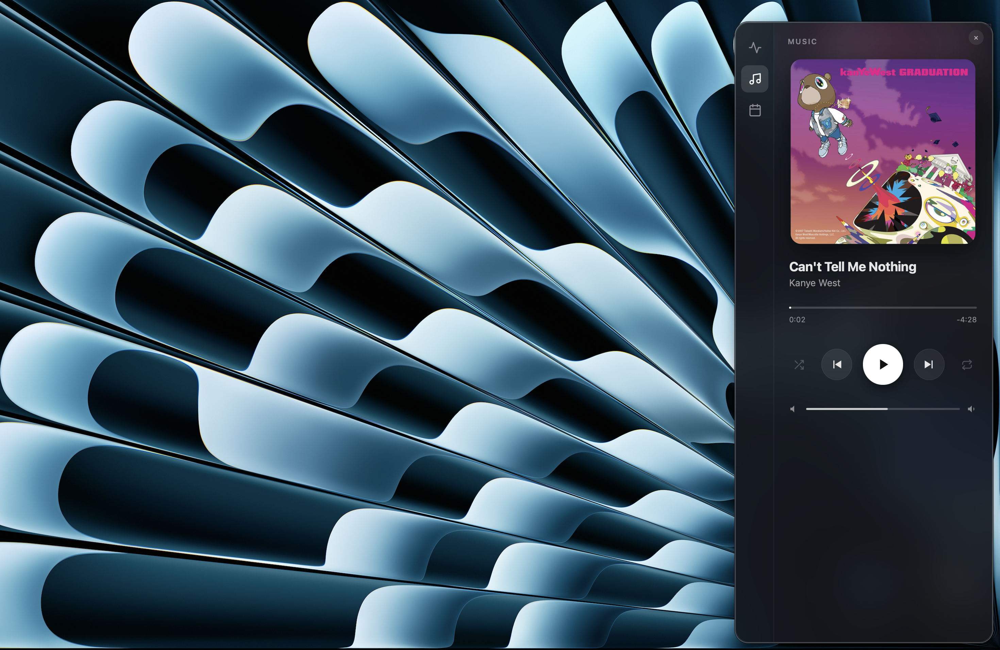

# Mac Control Center

A sleek, open-source menu-bar control center for macOS. Click the menu-bar icon (or hit a hotkey) and a frosted glass panel slides out from the screen edge with everything you glance at constantly — system stats, your music, and your day.

Built with [Tauri](https://tauri.app) (Rust + web frontend) and a small Swift helper for native calendar access. No Electron, no bloat — the app is a few MB and uses the system webview.



<!-- Add a screenshot at docs/screenshot.png -->

## Features

**System** — Live CPU and memory usage, plus a top-processes list sorted by memory. Each process has a two-click "arm then kill" button so you can quit a runaway app without opening Activity Monitor (and without accidentally nuking something).

**Music** — A full now-playing panel for the Spotify desktop app: album art with an ambient color glow, scrolling track title, a draggable seek bar, volume, and play / pause / skip / shuffle / repeat — all driven through macOS automation.

**Calendar** — Today's agenda pulled straight from your macOS Calendar via EventKit, grouped into Now / Upcoming / Earlier with a "happening now" highlight, plus a mini-month grid you can click to browse any day.

The panel docks full-height to the left or right screen edge (your choice), has no Dock icon, and can be summoned or dismissed with a global hotkey (**⌥Space**) or the menu-bar icon.

## Requirements

- **Apple Silicon Mac** (M1 or newer). The prebuilt download is `aarch64` only. Intel Macs need to build from source (see below).
- **macOS** — a recent version (built and tested on macOS 26).
- **Spotify desktop app** — required for the Music tab (it controls the local app, not the web player).
- **Permissions** — the app asks for **Calendar** access and **Automation** access to control Spotify the first time you use those tabs. Both are standard macOS privacy prompts; click Allow. You can manage them later under System Settings → Privacy & Security → Calendars / Automation.

## Install

### Option A — Download (easiest)

1. Grab the latest `.dmg` from the [Releases](https://github.com/smituic/mac-control-center/releases) page.
2. Open the `.dmg` and drag **Mac Control Center** to your Applications folder.
3. **First launch:** the app is not code-signed with an Apple Developer certificate (this is a free open-source project), so macOS will block it the first time. To open it:
   - **Right-click** (or Control-click) the app in Applications → **Open** → **Open** again in the dialog.
   - You only have to do this once. After that it opens normally.
4. Look for the new icon in your **menu bar** (top-right, near the clock) — the app has no window and no Dock icon by design. Click the icon to reveal the panel.

> Why the warning? Unsigned apps trigger macOS Gatekeeper. The right-click → Open step tells macOS you trust it. If you'd rather not run an unsigned binary, build it yourself with Option B.

### Option B — Build from source

You'll need the toolchain: [Xcode Command Line Tools](https://developer.apple.com/xcode/), [Rust](https://rustup.rs), [Node.js](https://nodejs.org) (20+), and Swift (included with the Command Line Tools).

```bash
# 1. Clone
git clone https://github.com/smituic/mac-control-center.git
cd mac-control-center

# 2. Install frontend dependencies
npm install

# 3. Compile the Swift calendar helper (native EventKit access)
swiftc -O src-tauri/helpers/calendar.swift -o src-tauri/helpers/calendar
cp src-tauri/helpers/calendar src-tauri/helpers/calendar-$(rustc -Vv | grep host | cut -d' ' -f2)

# 4a. Run in development
npm run tauri dev

# 4b. Or build a distributable app + dmg
npm run tauri build
# → src-tauri/target/release/bundle/macos/Mac Control Center.app
# → src-tauri/target/release/bundle/dmg/*.dmg
```

## Usage

- **Open / close the panel** — click the menu-bar icon, or press **⌥Space** from anywhere.
- **Switch tabs** — the icon rail on the panel's inner edge (System / Music / Calendar).
- **Kill a process** — on the System tab, click the ✕ on a row once (it arms, showing "kill?"), then again to quit it. Waits 2 seconds and disarms if you don't confirm.
- **Browse other days** — on the Calendar tab, click any date in the mini-month.
- **Move the panel** — right-click the menu-bar icon → **Dock Left** / **Dock Right**.
- **Hide** — the ✕ in the panel corner (reopen with the icon or hotkey).
- **Quit** — right-click the menu-bar icon → **Quit**.

## How it works

Tauri runs a Rust backend with an HTML/CSS/JS frontend in the native macOS WebView. The Rust side reads system stats with the [`sysinfo`](https://crates.io/crates/sysinfo) crate and controls Spotify by shelling out to AppleScript (`osascript`). Calendar data comes from a small standalone Swift binary that calls Apple's EventKit framework and returns JSON — bundled with the app as a Tauri sidecar. The frosted-glass look uses [`window-vibrancy`](https://crates.io/crates/window-vibrancy) on a transparent window.

## Known limitations

- **Apple Silicon only** in the prebuilt release (build from source for Intel).
- **Spotify tab needs the Spotify desktop app running** — it can't read the web player. Shuffle/repeat/volume work; reading the upcoming queue and lyrics aren't possible through Spotify's AppleScript.
- **Calendar** reads events from your local macOS Calendar; the dock-side preference resets to right on each launch.
- Not distributed through the Mac App Store (the transparent-window blur uses a private API that the App Store disallows).

## Contributing

Issues and pull requests welcome. This started as a learning project — if something's rough, it probably is; happy to have help improving it.

## License

MIT — see [LICENSE](LICENSE). Do what you like with it.
